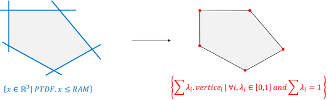
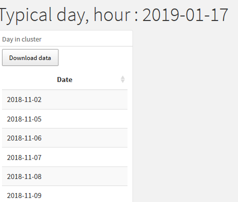
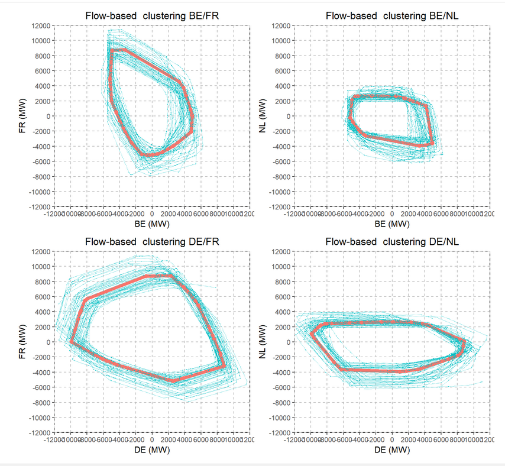
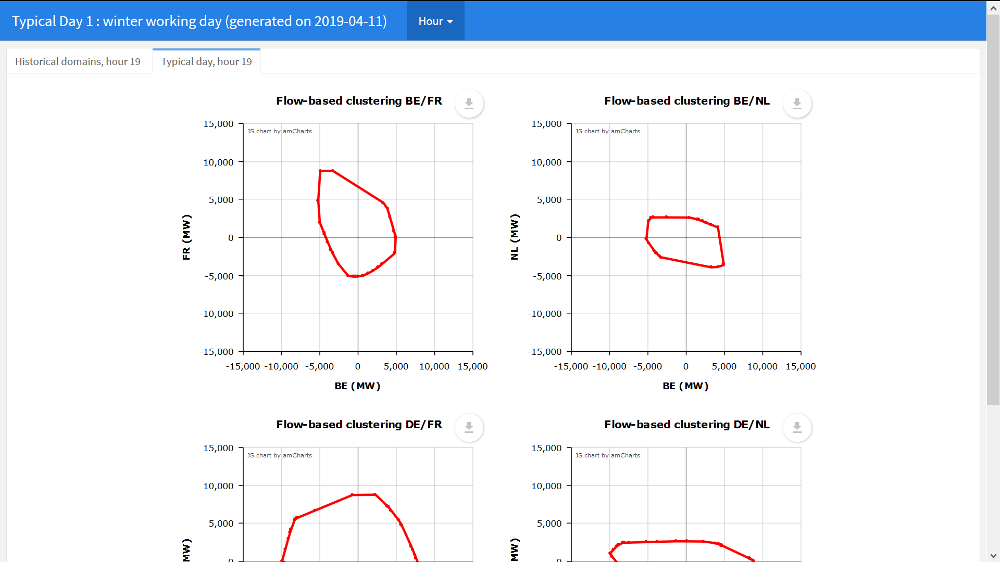

  
```{r setup, include=FALSE}
knitr::opts_chunk$set(echo = TRUE)
library(fbClust)
```


## <span style="color:blue">1 - Summary</span>

``fbClust`` allows to cluster typical **flow-based** days and to visualize their domains.

<!-- ```{r, eval=FALSE} -->

<!-- # Define dates for the clustering -->
<!-- dates <- seq(as.Date("2018-10-01"), as.Date("2018-10-04"), by = "day") -->

<!-- # Generate ptdf data from a constraint file and a factor file -->
<!-- PLAN <- getPreprocPlan( -->
<!--   pathPtdfMatrixFactor = "ptdfMatrixFactor.csv", -->
<!--   pathPtdfMatrixConstraint = "ptdfMatrixConstraint.csv") -->

<!-- # Clustering on the days -->
<!-- allTypeDay <- clusterTypicalDaysForOneClass( -->
<!--   VERT = NULL, PLAN = PLAN, nbCluster = 2, className = "interSaisonSe", -->
<!--   dates = dates) -->

<!-- # Plot the clusters -->
<!-- clusterPlot(allTypeDay, "FR", "BE", hour = 1, dayType = 1) -->
<!-- ``` -->


```{r, eval=FALSE}

# Define dates for the clustering
dates <- seq(as.Date("2018-10-01"), as.Date("2018-10-04"), by = "day")


# Generate ptdf data from a constraint file and a factor file
PLAN <- getPreprocPlan(
  pathPtdfMatrixFactor = system.file(
    "ptdfFactor.csv", package = "fbClust"),
  pathPtdfMatrixConstraint = system.file(
    "ptdfConstraint.csv", package = "fbClust"))


# Clustering on the days
allTypeDay <- clusterTypicalDaysForOneClass(
  VERT = NULL, PLAN = PLAN, nbCluster = 2, className = "interSaisonSe",
  dates = dates)

# Plot the clusters
clusterPlot(allTypeDay, "FR", "BE", hour = 1, dayType = 1)
```

<!-- With the fbClust package, you can : -->

<!-- * Read ptdf data from rds or csv (decomposed in two files, one with the ptdf and an other one with the rams). -->
<!-- * Define a calendar (a period on which the clustering will be made + distinction of each season). -->
<!-- * Transform the ptdf data to vertices (after substracting one ptdf to the others). -->
<!-- * Plot the section of a polyhedron generated by two countries for given date and hour. -->
<!-- * Make a clustering to get the typical days for one or more class. -->


## <span style="color:blue">2 - Building of input objects</span>

This section is a presentation of how to generate input objects which can be used to enjoy all the functionnalities of the package ``fbClust``.

### a/ Plans creation

The first step, whatever you want to do, is to generate a data.table containing the ptdf and the rams for dates and hours of interest.
To generate this data.table, the function you need to use is **getPreprocPlan**. 
This function takes in input two path, one to a csv (or rds) containing the ptdf (or factors), and one csv (or rds) containing the rams (or constraints).
Of course, these rams and ptdf need to be accompanied by dates and hours in order to generate the vertices of the flowbased domains.
If you need more information, you can write getPreprocPlan in the help section or use the command ?getPreprocPlan. This will be the case for every function presented in this vignette.

```{r}
# read ptdf data from rds or csv (the input is two files, one with the ptdf and one with the rams)
PLAN <- getPreprocPlan(
  pathPtdfMatrixFactor = system.file(
    "ptdfFactor.csv", package = "fbClust"),
  pathPtdfMatrixConstraint = system.file(
    "ptdfConstraint.csv", package = "fbClust"))
DT::datatable(PLAN[1:100])
```
This data.table is an example of what you have in output of getPreprocPlan if your inputs match.


### b/ Calendar generation

You can use the function **getCalendar** in order to generate a calendar in a named list. This calendar can be then used in the function clusterTypicalDays, which will be introduced later.
The function getCalendar takes three arguments.

- *dates* : An vector of dates (in character format), in the form YYYY-MM-DD.
  This vector can be compute using the function getSequence, which generate a sequence of dates, with a begin and an end and takes as input :
  - *dateBegin*, the first date, in format YYYY-MM-DD
  - *dateEnd*, the last date, in format YYYY-MM-DD
- *interSeasonBegin*, a character vector, (of length one or more), which contains begin dates for the interSeason (ex : spring and autumn)
- *interSeasonEnd*, a character vector, (of length one or more), which contains begin dates for the interSeason. Its length must match with the length of interSeasonBegin

You can use ?getSequence and ?getCalendar if you need more information

```{r}
# Define a calendar (period on which the clustering will be made + distinction of each season)
dates <- getSequence("2015-11-01", "2017-01-20")
interSeasonBegin <- c("2016-03-01", "2016-10-01")
interSeasonEnd <- c("2016-05-15", "2016-10-31")
calendar <- getCalendar(dates, interSeasonBegin, interSeasonEnd)
str(calendar)
```


### c/ The hubDrop, a key object

You will see in next sections the input *hubDrop*, which is used a lot.

*hubDrop* is an argument necessary to generate the vertices. In order to generate the vertices, you need to have hyperplans equations, which are obtained (in our case), by making the sustracting a ptdf to the others.
*hubDrop* has the following form :

```{r results = "hide"}
list(NL = c("BE", "DE", "FR", "AT"))
```
In this case, the ptdf NL will be sustracted to the others and then deleted. 
You can also use a multi-list like this :

```{r results = "hide"}
list(NL = c("BE", "DE", "FR", "AT"), AL1 = c("AL2"))

```
In this case, you will also have the sustraction of AL1 to AL2 and its deletion.


### d/ From ptdf to vertices [^1]

PTDF are the equations of the hyperplanes defining the limits of the domain, while the vertices are the coordinnates of the extreme points of the domain. 



To compute the vertices, the method can be done in two steps.

* **Step 1**: Compute the ptdf equations by applying the function setDiffNotWantedPtdf on the PLAN object[^2].
* **Step 2** Generate the vertices by using the function getVertices on the output of setDiffNotWantedPtdf.

[^1]: The user has no obligation to compute the vertices if he wants to realize a clustering. However, since generating the vertices take a large ammount of time, you can use the output of this function as the input of the clustering function (argument VERT), so the ptdf to vertices operation won't be done in the clustering function.

[^2]: It's preferable to create a new object (ex : PLAN2), instead of transforming the input because the output of this function cannot be used as an input of the clustering functions.

These equations are computed from the PLAN object. However, 

For now, you can generate the Vertices of your polyhedra using the function **getVertices**. This functionnality will probably be updated because you need to execute the function **setDiffNotWantedPtdf** firstly if you want to use this.

#### Generation of ptdf equations

The function **setDiffNotWantedPtdf** takes two arguments.

* *PLAN*, the output of getPreprocPlan.
* *hubDrop*, the key argument presented in the previous section.

This function computes the ptdf equations, a ptdf equation is written as follows :

A vertice V = ($V_{1}, \, V_{2}, \, V_{3}, \, V_{4}$) follows the following equation.

$ptdf_{1}*V_{1}+ptdf_{2}*V_{2}+ptdf_{3}*V_{3}+ptdf_{4}*V_{4} = ram$

```{r}
PLAN2 <- setDiffNotWantedPtdf(PLAN, list("NL" = c("BE", "DE", "FR", "AT")))
DT::datatable(PLAN2[1:100])
```

#### Generation of the vertices

The generation of the vertices can take several time, this is why the user is allowed to do it outside the clustering functions.

```{r}
# Transform the ptdf data to vertices (after substracting one column the the others)
VERT <- getVertices(PLAN2)

DT::datatable(VERT[1:100, list(Date, Period, FR = round(FR, 2), DE = round(DE, 2),
                               BE = round(BE, 2), AT = round(AT, 2))])
```


## <span style="color:blue">3 - Flowbased domains vizualisation</span>

If you have used the function **getPreprocPlan**, you can visualize flowbased domains for specified hours and dates. In order to have this visualization, you can use the function **plotFlowbased**. The main arguments of this function are the following.

* *PLAN*, the output data.table of the function getPreprocPlan
* *hubDrop*, a list of countries for the sustraction operations (explained in section 1 - d/)
* *country1*, the country on the x-axis for the plots
* *country2*, the country on the y-axis for the plots
* *dates*, the date(s) of the flowbased domains you want to see.
* *hours*, the hour(s) of the flowbased domains you want to see. All the combination of hours and dates in input are shown.
* *Other argument*, including the legend and title, xlim, ylim, you can see them all using ?plotFlowbased


```{r}
# Example with one plot
plotFlowbased(PLAN = PLAN, country1 = "FR", country2 = "DE", hubDrop = list(NL = c("BE", "DE", "FR", "AT")),
hours = 2, dates = "2018-10-03", domainsNames = NULL, main = NULL, width = "100%", height = "640px", export = F)
```


```{r}
# Example with four plots
plotFlowbased(PLAN = PLAN, country1 = "BE", country2 = "NL", hubDrop = list(NL = c("BE", "DE", "FR", "AT")),
hours = c(3, 4), dates = c("2018-10-02", "2018-10-04"), domainsNames = NULL,
main = NULL, width = "100%", height = "640px", xlim = c(-12000, 12000), ylim = c(-12000, 12000), export = F)
```


These graphics are sections of the polyhedra, on the axis corresponding to the input countries.


## <span style="color:blue">4 - Clustering methods</span>

In order to obtain the typical days, two clustering functions have been computed in this package.
These functions return a data.table object with the typical days, which days are in the clusters of each typical days, the distance of these days to the typical days.
The clustering method used is a k-medoids.


One is used for a sequence of dates and the other one for a calendar.
The main arguments of these functions are the following.

* *PLAN*, the data.table generated with the function getPreprocPlan.
* *VERT*, the vertices generated with the function getVertices. If the input is NULL, the getVertices is done in the clustering function.
* *hubDrop*, a list of countries for the sustraction operations (explained in section 1 - d/)
* *hourWeight*, a vector of length 24 with the weight of each hours for the calculation of the distance for the clustering method.
* *maxDomainSize*, the max value of a domain size in input of the clustering (i.e, the max value authorized in the VERT data.table)

### The function **clusterTypicalDaysForOneClass**

This function returns a data.table with a number of lines equal to the number of clusters generated.
Its main arguments, in addition of the ones presented before are the following.

* *nbClust*, the number of clusters generated
* *dates*, the dates on which the clustering should be computed.

If you need more details, you can use ?clusterTypicalDaysForOneClass

```{r message = FALSE, results = "hide"}
# Cluster the typical day for one class
allTypeDay <- clusterTypicalDaysForOneClass(
  VERT = VERT, PLAN = PLAN, dates = seq(as.Date("2018-10-01"), as.Date("2018-10-04"), by = "day"),
  hourWeight = rep(1, 24), nbCluster = 2, maxDomainSize = 20000, className = "interSaisonSe",
  list(NL = c("BE", "DE", "FR", "AT")))


```


Also, if you want to manipulate this object, you can use the function manipulateAllTypeDays, which is presented in next section.

<!-- The output object is built in three stages with different object at each stage. -->

<!-- * **TypicalDay**: Date of the typical day -->
<!-- * **Class**: The class of the cluster -->
<!-- * **dayIn**: The details of the days in the cluster -->
<!--   * *Date*: The dates of the days in the cluster -->
<!--   * *Period*: The hours available in the input data and so on the output. -->
<!--   * *VERT_details*: The details of the vertices for each day and period of the cluster. -->
<!--   * *PLAN_details*: The details of the plans (after sustracting one ptdf to the others) for each day and period of the cluster. -->
<!--   * *PLAN_raw_details*: The details of the ptdf (the output of getPreprocPlan) for each day and period of the cluster. -->
<!-- * **distance**: The distance of everyday in the cluster to its typical day. -->
<!--   * *Date*: The dates of the days in the cluster. -->
<!--   * *Distance*: The distances of the days in the cluster to the typical day. -->
<!-- * **idDayType**: The id of the cluster. -->


### The function **clusterTypicalDays**


The main difference of this function with the previous one is that it takes a calendar instead of dates in input.
The calendar flags each day, based on its position in the calendar list.
Then, the clustering is made for each group of day defined by the calendar ; a day can not be in more than one group.

The argument nbClust is also replaced by two arguments, nbClustWeek and nbClustWeekend, so a clustering based on the weekdays does not have to generate the same number of clusters than a clustering based on the weekends.

If you need more details, you can use ?clusterTypicalDays

```{r eval = FALSE}

# Or for many classes
dates <- getSequence("2018-09-01", "2019-08-31")
interSeasonBegin <- c("2018-10-01", "2019-03-01")
interSeasonEnd <- c("2018-11-30", "2019-05-31")
calendar <- getCalendar(dates, interSeasonBegin, interSeasonEnd)
dtClust <- clusteringTypicalDays(PLAN = PLAN, calendar = calendar,
                      hubDrop = list(NL = c("BE", "DE", "FR", "AT")), nbClustWeek = 3,
                      nbClustWeekend = 1, hourWeight = rep(1, 24), maxDomainSize = 20000,
                      VERT = NULL)

```

The output object is the same kind of the one obtained with the previous function.

### The function **manipulateAllTypeDays**

If you want to easily manipulate the output of the clustering functions, the function *manipulateAllTypeDays* is a tool which give you an easy access to what's in this output.

* The raw ptdf, which is the PLAN object in input of the function,
* The ptdf, which correspond to the facets equation of the polyhedra,
* the vertices, which is the VERT object (the vertices of the polyhedra),
* the summary of the clustering, with the typical days, the number of days in each cluster.

#### The raw ptdf

```{r}
ptdfraw <- manipulateAllTypeDays(allTypeDay, output = "ptdfraw")
DT::datatable(head(ptdfraw))
```


#### The ptdf

```{r}
ptdf <- manipulateAllTypeDays(allTypeDay, output = "ptdf")
DT::datatable(head(ptdf))
```

#### The vertices

```{r}
vertices <- manipulateAllTypeDays(allTypeDay, output = "vertices")
DT::datatable(head(vertices[, list(Date, Period, FR = round(FR, 2), 
                                   DE = round(DE, 2), AT = round(AT, 2), BE = round(BE, 2),
                                   Class, idDayType)]))
```

#### The summary

```{r}
summary <- manipulateAllTypeDays(allTypeDay, output = "summary")
DT::datatable(summary)
```

## <span style="color:blue">5 - Graphics after clustering</span>

The graph function **clusterPlot** has to be used on the output object of one of the two clustering functions. It is also the function called to generate the reports.

The main arguments of this function are the following.
* *data*, the output of one of the clustering function,
* *country1*, the name of the country whose net position is in the x axis,
* *country2*, the name of the country whose net position is in the y axis,
* *hour*, the hour of the shown domain,
* *dayType* the id of the cluster of interest,
* *typicalDayOnly*, do you want to render only the typical day or all the days in the cluster ?
* *ggplot*, should the graph be interactive or no ?


This first example is with a not interactive graph.

```{r, fig.align = "center", fig.width= 7, fig.height = 6}
clusterPlot(allTypeDay, "BE", "FR", hour = 1, dayType = 1, ggplot = TRUE, xlim = c(-12000, 12000), ylim = c(-12000, 12000), typicalDayOnly = TRUE)
```


This second example is with a not interactive graph.

```{r}
clusterPlot(allTypeDay, "AT", "DE", hour = 1, dayType = 1, ggplot = FALSE, width = "100%", height = "640px", xlim = c(-10000, 10000), ylim = c(-10000, 10000), typicalDayOnly = TRUE)
```


## <span style="color:blue">6 - The report function</span>

The function **generateClusteringReport** render a html with, for a given cluster, the sections of the flowbased domain on chosen countries hour by hour. The graphs are the same as in the plot in the previous section.
This function takes the following main arguments:
* *dayType* the id of the typical day,
* *outputfile* the folder where the html report iwll be saved,
* *data* the input data, corresponding to the output of one of the clustering functions.
* *countries* a list or a vector of characters with the combinations of countries used to visualize the domains.

```{r eval = FALSE}
### An example of the report generation


allTypDay <- readRDS(system.file("testdata/allTypDays.rds", package = "fbClust"))
generateClusteringReport(dayType = 1, data = allTypDay, outputFile = tempdir(),
countries = list(c("BE", "FR"), c("BE", "NL")), xlim = c(-12000, 12000),
ylim = c(-12000, 12000))

generateClusteringReport(dayType = 1, data = allTypDay, outputFile = tempdir(),
countries = c("AT", "FR", "NL", "DE"), xlim = c(-12000, 12000),
ylim = c(-12000, 12000))

```

These captures show you how the report is constituted.


<div style="text-align:center" markdown="1">

</div>

<div style="text-align:center" markdown="1">

</div>

<div style="text-align:center" markdown="1">

</div>


## <span style="color:blue">7 - Probabilities and quantiles</span>
Finally, the function ``getProbability()`` can be used to learn the correlations between the occurences of the different clusters and external data (typically climatic data). 

* ``climate`` : data table, the first column is the ``Date`` (``YYYY-MM-DD``), other columns are exogenous variables (e.g. wind speed and temperature)
* ``cluster`` : output of ``clusteringTypicalDays()`` or ``clusterTypicalDaysForOneClass()``

Below, an example of a climate file :
```{r, eval = TRUE, echo = FALSE}
climate <- data.table::fread(system.file("testdata/climate_example.txt",package = "fbClust"))
head(climate)
```

The quantiles are set with ``levelsProba``, and can be : 

* the same for all exogenous variables and classes using a ``numeric vector``
* set for each class (season / type of day) and climate variable using a ``named list``


```{r, echo = TRUE, eval = FALSE}
# same quantiles for each variables 
MatProb <- getProbability(climate, dtClust, levelsProba = c(1/3, 2/3))

# diffents quantiles for each class and variables 
levelsProba <- list(summerWd = list(FR_load = c(0.5), DE_wind = c(1/3, 2/3), DE_solar = .5),
                    winterWd = list(FR_load = c(0.5, 0.7), DE_wind = c(.5)))
MatProb <- getProbability(dtClust, allTypDay, levelsProba = levelsProba)
```
